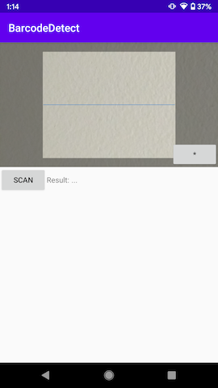

# Create your embedded scanner using Kotlin in Android

### [YouTube Video](https://youtu.be/vOHfBnfLRqw)

## The problem I got and how I solved it

I needed an embedded scanner when I was developing, and I just looked for information online and most of them I found are talking about using "Intent" to do it but I want an embedeed one. However, I found this [Create Barcode Scanner For Android Using Kotlin, Part 2](https://ariefbayu.xyz/create-barcode-scanner-for-android-using-kotlin-part-2-63656fa02609), it saved my life.

## Preview

## Implementation

### Create an embedded scanner
1. Adding library dependency
2. Adding compileOptions and kotlinOptions
3. Setting camera permission
4. Editing UI layout
5. Setting CaptureManager and decode callback

### Customize scanner layout
1. Editing custom scanner layout
2. Setting it to the original layou

### Flashlight
1. Adding a button to UI layout
2. Adding a state variable in activity
3. Adding a funcation to change state and available of flashlight

### Vibration
1. Setting vibrate permission
2. Adding a function to vibrate
3. Calling the funcation in the decode callback
